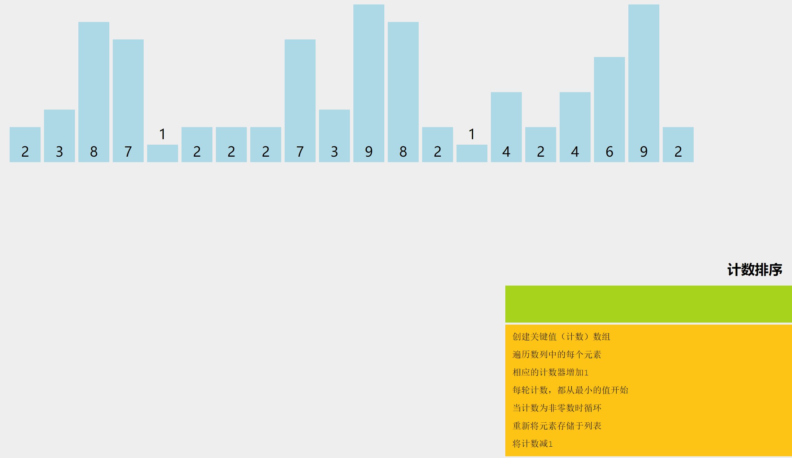

**extern "C"的主要作用就是为了能够正确实现C++代码调用其他C语言代码。加上extern "C"后，会指示编译器这部分代码按C语言（而不是C++）的方式进行编译。由于C++支持函数重载，因此编译器编译函数的过程中会将函数的参数类型也加到编译后的代码中，而不仅仅是函数名；而C语言并不支持函数重载，因此编译C语言代码的函数时不会带上函数的参数类型，一般只包括函数名。**

   这个功能十分有用处，因为在C++出现以前，很多代码都是C语言写的，而且很底层的库也是C语言写的，**为了更好的支持原来的C代码和已经写好的C语言库，需要在C++中尽可能的支持C，而extern "C"就是其中的一个策略。**

**这个功能主要用在下面的情况：**

1. **C++代码调用C语言代码**
2. **在C++的头文件中使用**
3. **在多个人协同开发时，可能有的人比较擅长C语言，而有的人擅长C++，这样的情况下也会有用到**

看一个简单的例子：

有moduleA、moduleB两个模块，B调用A中的代码，其中A是用C语言实现的，而B是利用C++实现的，下面给出一种实现方法：



```C++
//moduleA头文件
#ifndef __MODULE_A_H //对于模块A来说，这个宏是为了防止头文件的重复引用
#define __MODULE_A_H
int fun(int, int);
#endif
 
//moduleA实现文件moduleA.C //模块A的实现部分并没有改变
#include"moduleA"
int fun(int a, int b)
{
return a+b;
}
 
//moduleB头文件
#idndef __MODULE_B_H //很明显这一部分也是为了防止重复引用
#define __MODULE_B_H
#ifdef __cplusplus //而这一部分就是告诉编译器，如果定义了__cplusplus(即如果是cpp文件， extern "C"{ //因为cpp文件默认定义了该宏),则采用C语言方式进行编译
#include"moduleA.h"
#endif
… //其他代码
 
#ifdef __cplusplus
}
#endif
#endif
 
//moduleB实现文件 moduleB.cpp //B模块的实现也没有改变，只是头文件的设计变化了
#include"moduleB.h"
int main()
{
　　cout<<fun(2,3)<<endl;
}
```


补充介绍：

由于C、C++编译器对函数的编译处理是不完全相同的，尤其对于C++来说，支持函数的重载，编译后的函数一般是以函数名和形参类型来命名的。

例如函数**void fun(int, int)，编译后的可能是_fun_int_int(不同编译器可能不同，但都采用了类似的机制，用函数名和参数类型来命名编译后的函数名)；而C语言没有类似的重载机制，一般是利用函数名来指明编译后的函数名的，对应上面的函数可能会是_fun这样的名字。**

看下面的一个面试题：为什么标准头文件都有类似的结构？

```C++
#ifndef __INCvxWorksh /*防止该头文件被重复引用*/
#define __INCvxWorksh
#ifdef __cplusplus             //告诉编译器，这部分代码按C语言的格式进行编译，而不是C++的
extern "C"{
#endif
 
/*…*/
 
#ifdef __cplusplus
}
 
#endif
#endif /*end of __INCvxWorksh*/
```


**extern "C"包含双重含义**，从字面上可以知道，首先，被它修饰的目标是"extern"的；其次，被它修饰的目标代码是"C"的。

- 被extern "C"限定的函数或变量是extern类型的

extern是C/C++语言中表明函数和全局变量的作用范围的关键字，该关键字告诉编译器，其申明的函数和变量可以在本模块或其他模块中使用。

**记住**，语句：**extern int a; 仅仅是一个变量的声明，其并不是在定义变量a，也并未为a分配空间。变量a在所有模块中作为一种全局变量只能被定义一次，否则会出错。**

通常来说**，在模块的头文件中对本模块提供给其他模块引用的函数和全局变量以关键字extern生命。**例如，如果模块B要引用模块A中定义的全局变量和函数时只需包含模块A的头文件即可。这样模块B中调用模块A中的函数时，在编译阶段，模块B虽然找不到该函数，但并不会报错；它会在链接阶段从模块A编译生成的目标代码中找到该函数。

**extern对应的关键字是static，static表明变量或者函数只能在本模块中使用，因此，被static修饰的变量或者函数不可能被extern C修饰。**

- **被extern "C"修饰的变量和函数是按照C语言方式进行编译和链接的：这点很重要！！！！**

上面也提到过，由于C++支持函数重载，而C语言不支持，因此函数被C++编译后在**符号库**中的名字是与C语言不同的；C++编译后的函数需要加上参数的类型才能唯一标定重载后的函数，而加上extern "C"后，是为了向编译器指明这段代码按照C语言的方式进行编译

未加extern "C"声明时的链接方式：

```C++
//模块A头文件 moduleA.h
#idndef _MODULE_A_H
#define _MODULE_A_H
 
int foo(int x, int y);
#endif　
```

在模块B中调用该函数

```C++
//模块B实现文件 moduleB.cpp
#include"moduleA.h"
foo(2,3);　
```

实际上，**在链接阶段，链接器会从模块A生成的目标文件moduleA.obj中找_foo_int_int这样的符号，显然这是不可能找到的，因为foo()函数被编译成了_foo的符号，因此会出现链接错误。**

 

**extern "C"的使用要点总结**

1，可以是如下的单一语句：

```C++
extern "C" double sqrt(double);
```

2，可以是复合语句, 相当于复合语句中的声明都加了extern "C"

```C++
extern "C"
{
      double sqrt(double);
      int min(int, int);
}
```

3，可以包含头文件，相当于头文件中的声明都加了extern "C"

```C++
extern "C"
{
    ＃include <cmath>
}　
```

- 不可以将extern "C" 添加在函数内部
- 如果函数有多个声明，可以都加extern "C", 也可以只出现在第一次声明中，后面的声明会接受第一个链接指示符的规则。
- 除extern "C", 还有extern "FORTRAN" 等。

