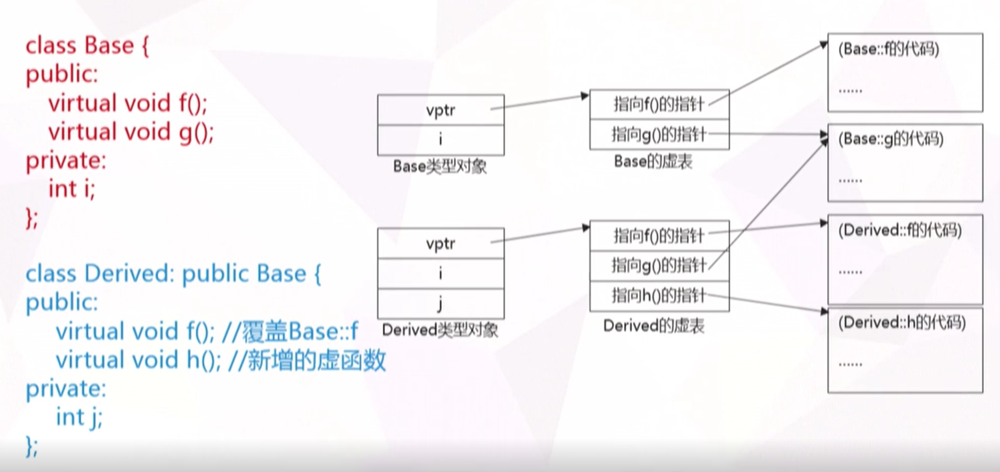

### 一、基类和派生类相关

##### 基类的成员函数会对派生类隐藏，原因如下： #####

```cpp
class A{
public:
    void show() { cout << "A"}
};

class B: public A{
public:
    void show(){ cout << "B" ;}
};

// 如果show()不隐藏，那么调用B.show()时是调用哪个函数呢？
```

==如果非要访问，可以采取以下形式==：

```cpp
class A {
public:
	void show(){}
};

class B : public A {
public:
	using A::A;
};

int main(int argc, const char* argv[])
{
	B b;
	b.A::show();
	system("pause");
	return 0;
}
```

​	

##### 调用拷贝构造和赋值构造问题 #####

```cpp
class A :exception{
public:
	A() {};
	A(const A& a) { cout << "copy construction\n"; }
	A& operator= (const A & a) { cout << "assignment\n"; return *this; };
};

int main(int argc, const char* argv[])
{
	A a;   
	A b(a);   //copy construction
	A c = a;  //copy construction
	c = a;    //assignment
	system("pause");
	return 0;
}
```


##### 1.1 小细节： #####

* 基类的私有成员只能基类自己使用，派生类及外部不能使用。

* 私有继承有什么？基类所有成员都不能访问！

  ```cpp
  class A :exception{
  public:
  	//变成了B中私有成员，只能B自己访问
  	void show(){}
  };
  
  class B : private A {
  public:
  	void show() {
  		__super::show();
  	}
  };
  
  int main(int argc, const char* argv[])
  {
  	B b;
  	b.show();  //OK
  	system("pause");
  	return 0;
  }
  ```

  ==私有继承作用==：可以用来实现*组合*，基类的protected和public成员在派生类中成了私有成员，符合组合定义。

* 保护继承：将基类的公有、保护成员变成保护，除了类继承家族外均不能使用。

* 当派生类中没有成员需要构造时，可以直接拿基类构造函数来使用。（如果不构造基类会出错）

  ```cpp
  class A :exception{
  public:
  	void show(){}
  };
  
  class B : private A {
  public:
  	using A::A;
  	void show() {
  		__super::show();
  	}
  };
  
  ```

* 多继承时，派生类要为每个基类调用构造函数，调用顺序与参数列表无关，只与继承的顺序有关。

### 二、虚基类 ###

引入原因：冗余会带来不一致性的后果。

```cpp
#include <iostream>
using namespace std;
class base0 {
	//定义基类Base0
public:
	int varO;
	void fun0() { cout << "Member of Base0" << endl; }
};

class Basel: public base0 {
	// 定义派生类 Base1
public: // 新增外部接口
	int var;
};
class Base2: public base0 {
		// 定义派生类Base2
	public: // 新增外部接口
		int var2;
};

//base1和base2都会var0   如果此时base3继承了base1和base2就有两份var0拷贝，需要指定
//base3.Base1::var 和  base3.Base2::var
//麻烦而且没必要，因此引入虚基类概念。如下，注意派生类构造函数都要初始化基类构造函数
#include <iostream>
using namespace std;
class base0 {
	int var0;
public:
	base0(int x):var0(x){}
	void fun0() { cout << "Member of Base0" << endl; }
};

class Base1 :virtual public base0 {
	Base1():base0(var){}
public:
	int var;
};
class Base2 : virtual public base0 {
	Base2(): base0(var2){}
public: 
	int var2;
};
```

2.1 例题：

```cpp
Derived(int var):Base0(var - 1),Base1(var),Base2(var + 1){}
```

定义 `Derived d(1)`，则 `d.var0` 的值为：


### 三、多态 ###

##### 向上转型： #####

* 一个**公有**派生类的对象在使用上可以被当作基类的对象，反之则不可。具体表现在
  派生类的对象可以隐含转换为*基类对象*
  派生类的对象可以初始化基类的*引用*。
  派生类的指针可以隐含转换为基类的*指针*。

* 通过基类对象名、引用、指针只能使用==基类中声明过的成员==。

  如下例子：

  ```cpp
  class Base1 {
  public:
  	void display() const {
  		cout << "Base1::display()" << endl;
  	}
  	void show() {}
  };
  
  class Base2 :public Base1 {
  public:
  	void display() const {
  		cout << "Base2::display()" << endl;
  	}
  };
  
  class Derived : public Base1,public Base2 {
  public:
  	void display() const {
  		cout << "Derived::diplay()" << endl;
  	}
  };
  
  //参数为指向基类对象的指针
  void fun(Base1 *ptr) { 
  	ptr->display();
  }
  
  int main(int argc, const char* argv[])
  {
  	Base1 base1;
  	Base2 base2;
  	Derived derived;
  
  	fun(&base1); //	Base1::display()
  	fun(&base2); //	Base1::display()
  	fun(&derived); // Base1::display()
  
  	system("pause");
  	return 0;
  }
  ```

  与期待不符合，如何改进？

##### 实现多态性-> 虚函数 #####

```cpp
class Base1 {
public:
	virtual void display() const;
	void show() {}
};

void Base1::display() const{
	cout << "Base1::display()" << endl;
}

class Base2 :public Base1 {
public:
	void display() const;
};

void Base2::display() const
{
	cout << "Base2::display()" << endl;
}

class Derived : public Base1{
public:
	virtual void display() const;
};

void Derived::display() const
{
	cout << "Derived::diplay()" << endl;
}

void fun(Base1 *ptr) { 
	ptr->display();
}

int main(int argc, const char* argv[])
{
	Base1 base1;
	Base2 base2;
	Derived derived;

	fun(&base1); //	Base1::display()
	fun(&base2); //	Base2::display()
	fun(&derived); //Derived::display()

	system("pause");
	return 0;
}
```

##### 虚函数表 #####




##### 虚析构函数 #####

```cpp
class Base {
public:
	~Base() { cout << "Base destruction " << endl;} 
};

class Derived : public Base {
	int *p;
public:
	Derived():p(new int(0)){}
	~Derived() { cout << "Derived destrution " << endl; delete p; }
};

void fun(Base* b)
{
	delete b;  //静态绑定，只会调用~Base()
}


int main(int argc, const char* argv[])
{

	Base* b = new Derived;
	fun(b);  // Base destruction
	system("pause");
	return 0;
}
```


##### 抽象类：顶层的基类，为所有继承家族服务（为了设计存在） #####

含有纯虚函数的类就是抽象类


##### overrivde和final #####

override显示声明要覆盖基类的某个函数，声明之后如果编译器找不到要覆盖的函数会报错！防止人为写错使用

```cpp
class Base {
public:
	virtual void show() { cout << "Base"; };
};

class Derived : public Base {
public:
	void show() override{ cout << "Base"; };
};
```

声明为final的类不能被继承（当系统很安全稳定时不希望用户改变）

```cpp
struct f final{ //... 
	virtual void ff() final {}
};
```


##### 第三章习题 #####

3.1  如下程序

```cpp
class A{
public:
	virtual void fun();
};
```

sizeof是C++中的一个操作符，作用是返回一个对象或者类型所占的内存字节数，则在64位机器上，sizeof(A)为:


3.2 在Visual Stuidio和C++11标准中，可以将override与final用作变量名和函数名，它们不是语言本身的关键字，但不建议这样使用。


3.3 有四个人，其中有一个人做了好事。为了找出谁做了好事，询问了他们并得到回答：

​	A ：不是我

​	B：是C

​	C:   是D

​	D：C胡说

编写程序判断是谁做了好事。


3.4 利用筛法判断2-100的素数？


### 四、运算符重载 ###

1. 不能重载的运算符

> 作用域操作符：::     
>
> 条件操作符：?:     
>
> 点操作符：.     
>
> 指向成员操作的指针操作符：->\*， .*     
>
> 预处理符号：＃


2. 单目运算符： 前置++和后置++ ： 

   区分operator++：函数重载靠参数表区分，  后置++需要一个整型形参（不要使用）

```cpp
class Clock {//时钟类定义
public:
	Clock(int hour = 0, int minute = 0, int second = 0);
	void showTime() const;
	//前置单目运算符重载
	Clock& operator ++ ();
	//后置单目运算符重载
	Clock operator ++ (int);
private:
	int hour, minute, second;
};

Clock::Clock(int hour, int minute, int second) {
	if (0 <= hour && hour < 24 && 0 <= minute && minute < 60
		&& 0 <= second && second < 60) {
		this->hour = hour;
		this->minute = minute;
		this->second = second;
	}
	else {
		cout << "Time error!" << endl;
	}
}

void Clock::showTime() const { //显示时间
	cout << hour << ":" << minute << ":" << second << endl;
}

Clock & Clock::operator ++ () {
	second++;
	if (second >= 60) {
		second -= 60; 
		minute++;
		if (minute >= 60) {
			minute -= 60; 
			hour = (hour + 1) % 24;
		}
	}
	return *this;
}

Clock Clock::operator ++ (int) {
	//注意形参表中的整型参数
	Clock old = *this;
	++(*this); //调用前置“++”运算符
	return old;
}

int main(int argc, const char* argv[])
{
	Clock myClock(23, 59, 59);
	
	cout << "First time output: ";
	myClock.showTime();
	
	cout << "Show myClock++: ";
	(myClock++).showTime();
	
	cout << "Show ++myClock: ";
	(++myClock).showTime(); 
	
	system("pause");
	return 0;
}
```


3. 重载为非成员函数  
   * 如果要访问类的私有成员，要声明为友元
   * 重载函数参数列表中至少有一个自定义类型（不然我们可以重新定义 1 + 1内部为1 -1 这样会导致不可控制）


##### 第四章 习题 #####

4.1 下列关于运算符重载的说法中,错误的是

> A、new和delete运算符可以重载
>
> B、重载运算符不能改变其原有的操作数个数
>
> C、三元运算符“?:”不能重载
>
> D、所有运算符既可以作为类的成员函数重载,又可以作为非成员函数重载


### 五、泛型编程 ###

1. 要点总结

   * `template `函数模板是支持默认参数的，T1 、T2顺序在默认情况下是可以任意的，不用严格按照从右到左的顺序。

   * 类模板不像是函数模板 ，函数模板会根据参数推断类型。 当然类模板也支持默认参数，但是类模板必须严格从右往左默认化。

   * ==成员模板==

     ```cpp
      template <class T>
      class Myclass
      {
          public:
             T a;
             template <typename type_1 , typename type_2>
              type_1 add(const type_1 lva ,const type_2 rva);
      };
     
      template <class T>
          template <typename type_1,typename type_2>
      type_1 Myclass<T>::add(const type_1 lva, const type_2 rva)
      {
          a = lva + rva;
          return a;
      }
     ```

   * 嵌套模板

     ```cpp
      template <class T>
      class Myclass
      {
          public:
             T a;
             template <typename type_1 , typename type_2>
              type_1 add(const type_1 lva ,const type_2 rva);
     
              template <class type_3>
              class Myclass_2;         // 声明放在这里，具体定义放在类外进行。
              Myclass_2<T> C;          // 定义一个Myclass_2 类 A。使用 T 进行实例化
      };
     
      template <class T>
          template <typename type_1,typename type_2>
      type_1 Myclass<T>::add(const type_1 lva, const type_2 rva)
      {
          a = lva + rva;
          return a;
      }
     
      template <class T>
          template <class type_3>
          class Myclass<T>::Myclass_2
          {
              public:
                  type_3 value;
                  type_3 sub(const type_3 a , const type_3 b) {vlaue = a - b;} 
          };
     ```

     


### 练习题答案 ###

2.1 答案：0

3.1 答案：A中含有一个指向虚表的指针，在64位机器上，指针占8个字节。

3.2 答案：正确

3.3 答案：

```cpp
void getDoRightThing() {
	bool has_one = false;
	int judge = 0;
	for (char thisman = 'A'; thisman <= 'D'; ++thisman)
	{
		judge = (thisman != 'A') + (thisman == 'C') + (thisman == 'D') + (thisman != 'D');
		if (judge == 3) {
			cout << "thisman is " << thisman << endl;
			has_one = true;
			break;
		}
	}
	if (!has_one) cout << "thisman not exist" << endl;
}
```

3.4 答案：

```cpp
int main(int agrc, const char* argv)
{
	//求2-100之间的素数（筛法，速度要比枚举法要快）	
	int prime[101] = { 1,1 };
	int d = 2;    

	do {
		int k = d;
		if (prime[k] == 0) {
			k += d;
			while (k <= 100) {
				prime[k] = 1;
				k += d;  //
			}
		}
		d++;
	} while (d <= 10);    //10 = sqrt(100);

	for (int i = 2; i <= 100; ++i) {
		if (prime[i] == 0) {
			cout << i << "是素数  ";
		}
	}

	system("pause");
	return 0;
}

//版本2 for循环
for (int d = 2; d < 10; d++) {
    if (prime[d])  continue;
    for (int k = d + d; k <= 100; k += d) {
        prime[k] = 1;
    }
}
```


4.1 答案：D 有部分运算符不能重载，比如三元运算符，::运算符和.运算符,且部分运算符不能重载为成员函数

​					   不能作为成员函数重载（如流运算符）

​					   ===,[],(),->只能通过成员函数来重载==

​                       C++规定赋值运算符“=”只能重载为类的非静态成员函数，而不可以重载为类的友元函数。
​                       不能重载为类的静态成员应该比较容易理解，因为静态成员函数是属于整个类的，不是属于某个对象      					   的，它只能去操作类静态数据成员。而赋值运算符“=”是基于对象操作的。

​			