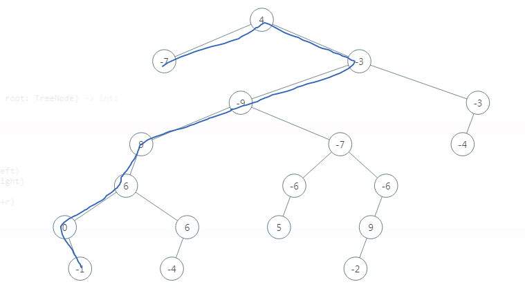
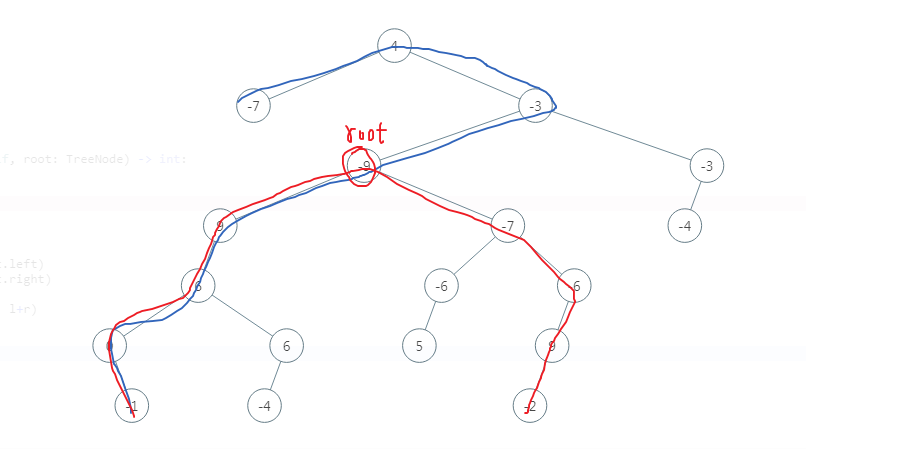

### 树算法
#### 543. 二叉树的直径
给定一棵二叉树，你需要计算它的直径长度。一棵二叉树的直径长度是任意两个结点路径长度中的最大值。这条路径可能穿过根结点。

示例 :
给定二叉树

          1
         / \
        2   3
       / \     
      4   5    
返回 `3`, 它的长度是路径 `[4,2,1,3]` 或者 `[5,2,1,3]`。

注意：两结点之间的路径长度是以它们之间边的数目表示。

##### 思路
任意一个结点，都要记录以此结点为根的直径情况：左子树高度+右子树高度
>    二叉树的直径：二叉树中从一个结点到另一个节点最长的路径，叫做二叉树的直径
>采用分治和递归的思想：
>    - 根节点为root的二叉树的直径 = max(root->left的直径，root->right的直径，root->left的最大深度+root->right的最大深度+1)
* 错误做法： 认为直径就是 `左子树高度+右子树高度`
``` Python
class Solution:
    def diameterOfBinaryTree(self,root:TreeNode) -> int:
        if not root:
            return 0
        return self.get_height(root.left) + self.get_height(root.right)

    def get_heigh(self,root):
        if not root
            return 0
        return max(self.get_heigh(root.left),self.get_heigh(root.right)) + 1
```

* 错误原因：忽略了直径可能没经过root节点v

实际上可以这样：


##### 代码实现
``` cpp
class Solution{
public:
     int diameterOfBinaryTree(TreeNode* root) {
           if(!root) return 0;
        int maxi = 0;
        get_height(root, maxi);
        return maxi;    
    }

    int get_height(TreeNode* root,int &maxi){
        if(!root) return 0;
        int l = get_height(root->right, maxi);
        int r = get_height(root->left, maxi);
        maxi = max(maxi, l + r);
        return max(l,r) + 1;
    }
};
```
